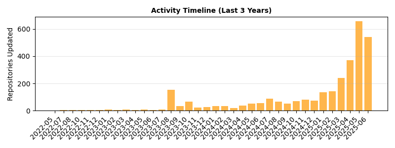

# Godot Stars!

Here we provide a leaderboard for assets in the Godot Asset Library.

## Overview

- Total repositories analyzed: 53
- Successful GitHub API calls: 52
- Total stars across all repos: 8,790
- Total forks across all repos: 2,010
- Average stars per repository: 169.0
- Median stars per repository: 6.5
- Repositories with >100 stars: 5
- Categories represented: 9

Most popular category: 2D Tools (13 repositories)

## Repositories by Category

Repositories with 10+ stars, ranked by GitHub stars.

### Demos

| Repository | Stars | Forks | Last Updated | License |
|------------|-------|-------|--------------|----------|
| [2.5D Demo](https://github.com/godotengine/godot-demo-projects) | 6,933 | 1,834 | 2025-06-08 | MIT |
| [2D Flocking Demo](https://github.com/meloonics/Flocking) | 18 | 2 | 2023-07-26 | GPLv3 |
| [10 Simple Shader Examples (with Video)](https://github.com/Goldenlion5648/ShaderExamplesWithVideo) | 14 | 6 | 2024-11-15 | MIT |
| [2D Hexagonal Map Navigation Demo](https://github.com/Dimithrandir/godot_2d_hex_map_nav_demo) | 13 | 2 | 2025-04-15 | MIT |
| [Godot 3D Flight Control Tutorial](https://github.com/UtMan88/Godot3DFlightControls) | 11 | 0 | 2024-10-23 | MIT |

### Tools

| Repository | Stars | Forks | Last Updated | License |
|------------|-------|-------|--------------|----------|
| [Virtual Joystick](https://github.com/MarcoFazioRandom/Virtual-Joystick-Godot) | 839 | 87 | 2025-06-08 | MIT |
| [GdScript2All](https://github.com/Lcbx/GdScript2All) | 205 | 7 | 2025-05-24 | GPLv3 |
| [TextEditor Integration](https://github.com/fenix-hub/godot-engine.text-editor) | 144 | 16 | 2025-05-29 | MIT |
| [RhythmNotifier - Sync Your Game to the Beat of the Music (Sound & Audio)](https://github.com/michaelgundlach/rhythm_notifier) | 30 | 5 | 2025-05-09 | MIT |
| [2, 4, 8 Godot-multidirectional-joystick](https://github.com/JstnJrg/Godot_multidirectional_joystick) | 16 | 0 | 2025-04-09 | CC0 |
| [TODO 4](https://github.com/Vacui/TODO_4) | 11 | 0 | 2024-12-18 | MIT |

### Templates

| Repository | Stars | Forks | Last Updated | License |
|------------|-------|-------|--------------|----------|
| [Takin Game Template](https://github.com/TinyTakinTeller/TakinGodotTemplate) | 306 | 20 | 2025-06-07 | MIT |
| [2.5D World Map with Selection](https://github.com/rafgro/godot25dmap) | 14 | 1 | 2025-05-13 | MIT |
| [Thirdperson Controller (.NET)](https://github.com/vaporvee/gd-net-thirdpersoncontroller) | 12 | 3 | 2025-05-23 | MIT |
| [2D grid based movement](https://github.com/IconocatStudio/godot2dgridmovement) | 12 | 2 | 2025-05-16 | MIT |

### 3D Tools

| Repository | Stars | Forks | Last Updated | License |
|------------|-------|-------|--------------|----------|
| ["Immersive" First Person Controller](https://github.com/Levox98/Godot_First-Person-Controller) | 43 | 2 | 2025-06-01 | MIT |

### Scripts

| Repository | Stars | Forks | Last Updated | License |
|------------|-------|-------|--------------|----------|
| [DungeonCrawler3D](https://github.com/Rebelion-Board-game/DungonCrawler) | 24 | 2 | 2025-05-27 | CC0 |

### 2D Tools

| Repository | Stars | Forks | Last Updated | License |
|------------|-------|-------|--------------|----------|
| [2D Liquid Simulator](https://github.com/L-Marcel/2D-Liquid-Simulator) | 18 | 1 | 2025-01-17 | MIT |

## Non-GitHub Assets

4 assets without GitHub repositories, sorted alphabetically.

| Asset | Category | License | Author |
|-------|----------|---------|---------|
| [.nw Level Importer](https://godotengine.org/asset-library/asset/2252) | 2D Tools | MIT | irxzirox |
| [2D Dungeon Generator](https://godotengine.org/asset-library/asset/97) | 2D Tools | MIT | halfwaywrong |
| [2D Flipscreen Library with Scrolling](https://godotengine.org/asset-library/asset/952) | Templates | MIT | chucklepie |
| [Kenney Prototype Tools](https://godotengine.org/asset-library/asset/1086) | 3D Tools | CC0 | MrMinimal |

Generated on 2025-06-08## Visualizations

