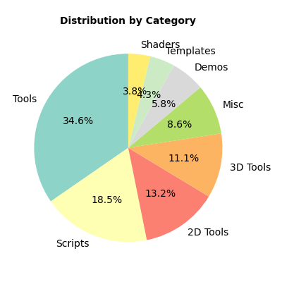

# Top Godot GitHub Repositories by Category

## Demos

| Name | Stars | Forks | LastUpdated |
|------|-------|-------|-------------|
| [2.5D Demo](https://github.com/godotengine/godot-demo-projects) | 6,933 | 1,833 | 2025-06-07 |
| [10 Simple Shader Examples (with Video)](https://github.com/Goldenlion5648/ShaderExamplesWithVideo) | 14 | 6 | 2024-11-15 |
| [Godot 3D Flight Control Tutorial](https://github.com/UtMan88/Godot3DFlightControls) | 11 | 0 | 2024-10-23 |
| [2048 Demo](https://github.com/DeanNevan/Godot4-Beta7-Test1-2048) | 7 | 2 | 2023-10-29 |

## Tools

| Name | Stars | Forks | LastUpdated |
|------|-------|-------|-------------|
| [Virtual Joystick](https://github.com/MarcoFazioRandom/Virtual-Joystick-Godot) | 838 | 87 | 2025-06-05 |
| [GdScript2All](https://github.com/Lcbx/GdScript2All) | 205 | 7 | 2025-05-24 |
| [TextEditor Integration](https://github.com/fenix-hub/godot-engine.text-editor) | 144 | 16 | 2025-05-29 |
| [RhythmNotifier - Sync Your Game to the Beat of the Music (Sound & Audio)](https://github.com/michaelgundlach/rhythm_notifier) | 30 | 5 | 2025-05-09 |
| [2, 4, 8 Godot-multidirectional-joystick](https://github.com/JstnJrg/Godot_multidirectional_joystick) | 16 | 0 | 2025-04-09 |

## Templates

| Name | Stars | Forks | LastUpdated |
|------|-------|-------|-------------|
| [Takin Game Template](https://github.com/TinyTakinTeller/TakinGodotTemplate) | 306 | 20 | 2025-06-07 |
| [2.5D World Map with Selection](https://github.com/rafgro/godot25dmap) | 14 | 1 | 2025-05-13 |
| [Thirdperson Controller (.NET)](https://github.com/vaporvee/gd-net-thirdpersoncontroller) | 12 | 3 | 2025-05-23 |

## 3D Tools

| Name | Stars | Forks | LastUpdated |
|------|-------|-------|-------------|
| ["Immersive" First Person Controller](https://github.com/Levox98/Godot_First-Person-Controller) | 43 | 2 | 2025-06-01 |
| [3d Maze Generator](https://github.com/mojoyup1528/maze_generator3D) | 0 | 0 | 2024-02-04 |

## Scripts

| Name | Stars | Forks | LastUpdated |
|------|-------|-------|-------------|
| [DungeonCrawler3D](https://github.com/Rebelion-Board-game/DungonCrawler) | 24 | 2 | 2025-05-27 |
| [2.5D Sprite Rotator](https://github.com/styr0x/2.5D-Sprite-Rotator--Godot-4-) | 9 | 0 | 2025-03-29 |
| [Alexandria - alexandria.netserver](https://github.com/BtheDestroyer/godot-alexandria) | 8 | 0 | 2024-12-07 |
| [2090s Language System](https://github.com/NeroNekro/Godot_Language_System) | 6 | 0 | 2024-07-13 |
| [GodotTouchCamera](https://github.com/DionHo/GodotTouchCamera) | 5 | 0 | 2024-06-01 |

## 2D Tools

| Name | Stars | Forks | LastUpdated |
|------|-------|-------|-------------|
| [1$ gesture recogniser and recorder](https://github.com/blurymind/1dollar_gesture_recogniser) | 9 | 9 | 2023-12-25 |
| [Godot Atlas Cutter](https://github.com/newold3/Auto-Slice-Atlas) | 8 | 1 | 2025-01-01 |
| [2D Camera Controller Singleton / with Dev Tools](https://github.com/jessejburton/GodotCameraController2D) | 8 | 1 | 2024-07-05 |
| [Godot Tiled Tools](https://github.com/Frontrider/Godot-Tiled-Tools) | 2 | 0 | 2024-06-09 |
| [Godot-Spyglass](https://github.com/NovaDC/Godot-Spyglass) | 1 | 1 | 2024-11-04 |

## Misc

| Name | Stars | Forks | LastUpdated |
|------|-------|-------|-------------|
| [Follow Parent](https://github.com/KarlTheCool/FollowParent) | 6 | 1 | 2024-03-25 |
| [Kenney's UI Audio](https://github.com/Loppansson/kenney-ui-audio-for-godot) | 3 | 0 | 2023-12-02 |
| [Visibility shortcut](https://github.com/Janders1800/godot-visibility-shortcut) | 2 | 0 | 2025-03-18 |

## Materials

| Name | Stars | Forks | LastUpdated |
|------|-------|-------|-------------|
| [.mtl loader](https://github.com/Quakermann/.mtl-loader) | 3 | 1 | 2023-10-17 |

## Visualizations

